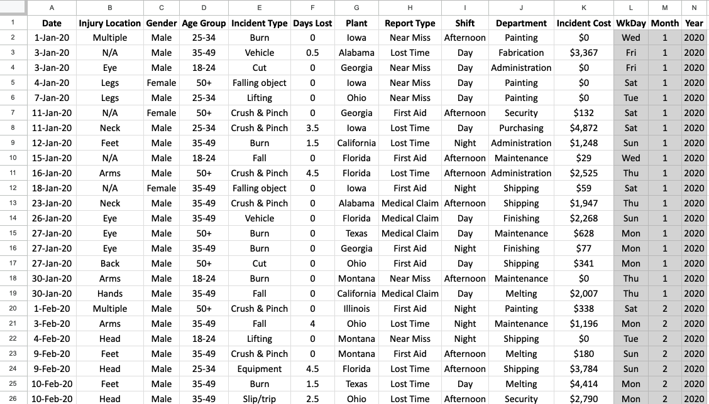

# Homework - Safety Database

The following google sheet contains a database of safety incidents that have occurred in construction company

You can find the Job Safety Database in the following Google Sheet: [Employee Database](https://docs.google.com/spreadsheets/d/1pGdgsPzEM5ut-0GVPKQJ8Kz7nSL1OHsaVC_KOrr0MKk/copy?gid=0#gid=0)

## Instructions

1. Go to the sheet titled "2021_med_claims" and write a queries as described in the text box on that sheet.
2. Go to the sheet titled "days_lost_claims" and write a queries as described in the text box on that sheet.

## Submission

To submit your homework, upload a link to your Google Sheet on Learning Suite. 